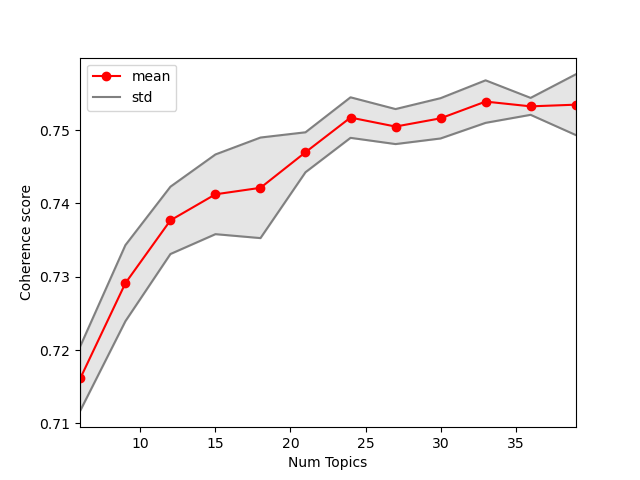
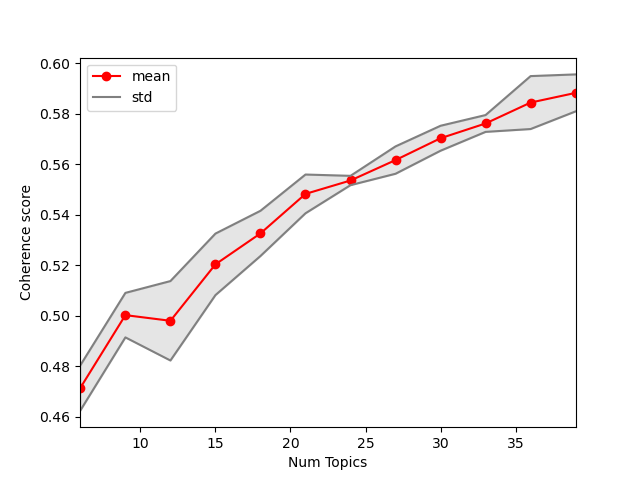

# Latent Aspect Mining


The aspects of a product or service that customers review are those on which they express their opinions and views. It is crucial to a customer-centric business to recognize and prioritize customers' needs in order to maintain revenues and to reduce customer churn. Currently, supervised learning methods are usually trained on human-annotated data to detect surface forms of aspects. They fall short when aspects are <i>latent</i> in reviews. Yet, there is no explicit surface form representation for aspects in 35\% of reviews of electronics and restaurants. Using opinion expressions, we proposed an unsupervised method to extract latent aspects.

<br>


### Dependencies

* python        3.8.8
* nltk          3.5
* scikit-learn  0.24.1
* spacy         3.0.5
* gensim        3.8.3
* textblob      0.15.3

Also to make use of Spacy language model, run
```bash
$ conda install -c conda-forge spacy

$ pip install spacy-transformers
$ pip install spacy-lookups-data

$ python -m spacy download en_core_web_trf
```
See also requirements.txt
You can install requirements, using the following command.

```bash
$ pip install -r requirements.txt
```

<br>

### Data
You can find the pre-processed datasets and the pre-trained models in the ```\data``` folder.
Run the following command:
```bash
$ python Main.py --path data\Canadian_Restaurant_preprocessed_corrected.xlsx --preprocess False
```

You can also use the original datasets of Restaurant domain. 
For preprocessing, run:
```bash
$ python Main.py --path data\data\Canadian_Restaurant.xlsx
```
The preprocessed files and lda model for each domain will
be saved in folders prep_and_seg/~ and models/~ respectively.

<br>

### Using Pre-Trained Models
Models can be built and reused, to do that, run:
```bash
$ python Main.py --tune False --aspect_model pxp_model_aspect.pxp \
                 --opinion_model pxp_model_opinion.pxp \
                 --all_nodeol pxp_model_all.pxp
```
<br>

### Tune
Number of extracted topics can be automatically detected by default:
or explicitly indicated, run:
```bash
$ python Main.py --tune False --num_topics 20
``` 
Tune logic is to first break dataset using KFold to 5 smaller parts
then iteratively calculate coherence value for each, using mean and std in the 
process of choosing optimal number of topics, here are results for noun dataset and adjective dataset:

<br>

##### For ASPECTs: 

optimal number: 36 

<br>

##### For OPINIONs:

optimal number: 39
<br>

### Inference
To derive results from trained models run:
```bash
$ python Main.py --inference inference_set.xlsx
```
note that models need to be indicated first, otherwise 
a model will be build from default settings.

<br>


### Costs

* Memory-count < 2GB
* Working set < 1GB
* CPU Avg. cycle = 49.7
* Pipline actual duration is ~11 hours on a dataset of size ~6800 

<br>
